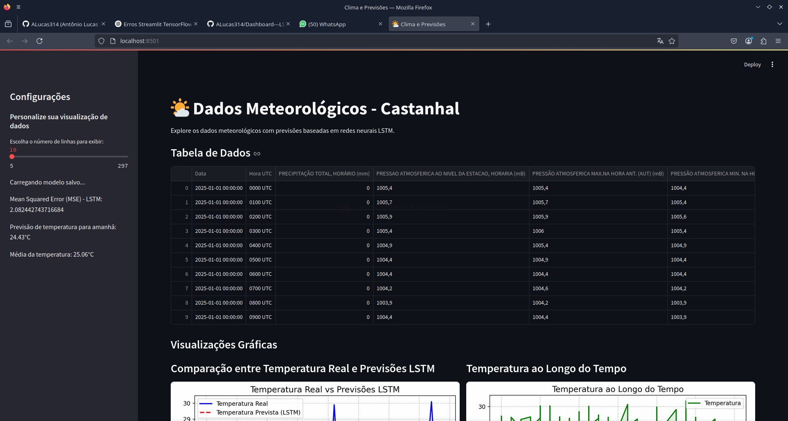

## 🛠 Tools and Skills 🔗

---

# Pokedex-Details

    
    

 

> Imagem mostrando uma prévia do projeto, se ficou curioso acesse tanto pelo link app ao lado ou escaneie o QRcode.

---

### Ajustes e melhorias

Basicamente o projeto foi capaz de realizar as seguintes tarefas:

- [x] Animações simples 1
- [x] Responsividade 2
- [x] Conexão com o banco de dados
- [x] Treinamento da rede neural LSTM
- [x] Carregamento do peso da rede neural LSTM
- [x] Exibir gráficos sobre o clima
